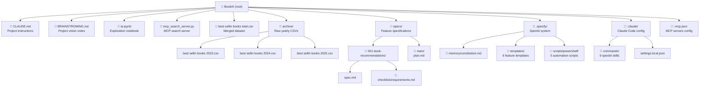
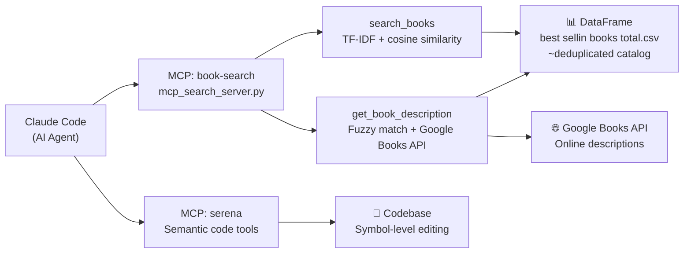
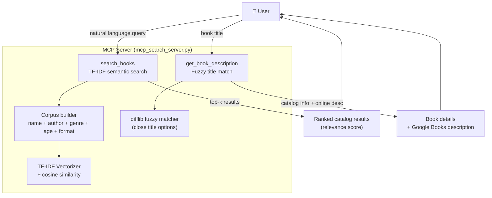
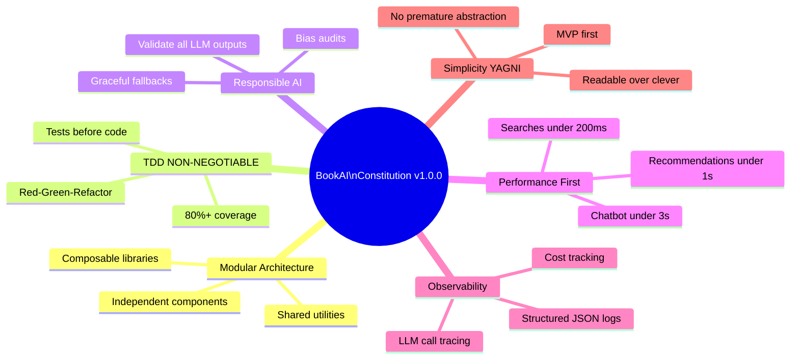

# BookAI - Project Structure

## Repository Layout

---

## MCP Server Architecture

---

## Speckit Development Workflow

---

## Feature 001 - Book Recommendations

---

## Constitution Principles

